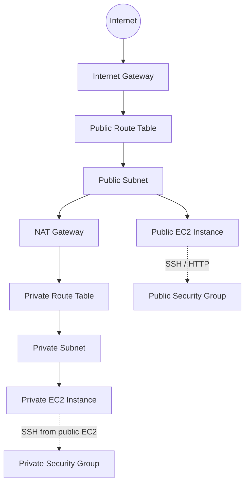

# AWS Network with Terraform

This repository provisions a small AWS network lab with Terraform. It creates a VPC, one public subnet, one private subnet, internet and NAT gateways, route tables, security groups, and two EC2 instances.

## Architecture



## What Terraform Builds

- One VPC with DNS support enabled
- One public subnet and one private subnet
- An internet gateway for public access
- A NAT gateway for private subnet egress
- Separate route tables for public and private traffic
- Security groups for public and private EC2 access
- Two Amazon Linux EC2 instances, one in each subnet

## Project Files

- `versions.tf` sets the Terraform and AWS provider versions
- `providers.tf` configures the AWS provider and default tags
- `vpc.tf` defines the network core and routing
- `security-groups.tf` defines ingress and egress rules
- `ec2.tf` launches the EC2 instances
- `variables.tf` defines the configurable inputs
- `locals.tf` builds shared naming values
- `outputs.tf` exposes useful values after apply

## Prerequisites

- Terraform 1.6 or newer
- AWS credentials available in the profile configured in `terraform.tfvars`
- An existing AWS key pair name for SSH access

## Usage

```bash
terraform init
terraform plan
terraform apply
```

After deployment, Terraform prints outputs such as the public IP, private IPs, and VPC ID.

To remove everything:

```bash
terraform destroy
```

## Notes

- The repository includes `terraform.tfstate` files locally; they should not be committed in future changes.
- If you want a safer workflow, keep environment-specific values in a local `terraform.tfvars` file and avoid storing secrets in the repository.
