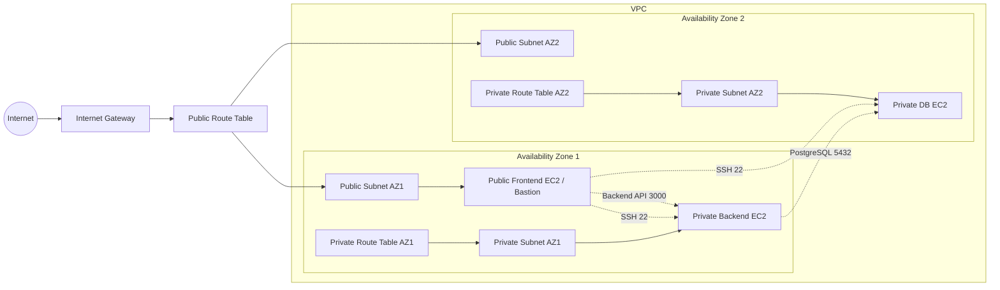

# AWS Network with Terraform

This repository provisions a small AWS network lab with Terraform. It creates a VPC, two public subnets, two private subnets, internet gateway, route tables, security groups, and three EC2 instances.

## Architecture



## What Terraform Builds

- One VPC with DNS support enabled
- Two public subnets and two private subnets across two Availability Zones
- An internet gateway for public access
- A shared public route table and per-AZ private route tables (no internet route from private subnets)
- Security groups for public app, private app, and private database instances
- Three Ubuntu EC2 instances:
  - One public frontend EC2 instance (also used as bastion host)
  - One private backend EC2 instance
  - One private database EC2 instance

## Project Files

- `versions.tf` sets the Terraform and AWS provider versions
- `providers.tf` configures the AWS provider and default tags
- `vpc.tf` defines the network core and routing
- `security-groups.tf` defines ingress and egress rules
- `ec2.tf` launches the EC2 instances
- `variables.tf` defines the configurable inputs
- `locals.tf` builds shared naming values
- `outputs.tf` exposes useful values after apply

## Prerequisites

- Terraform 1.6 or newer
- AWS credentials available in the profile configured in `terraform.tfvars`
- An existing AWS key pair name for SSH access

## Security Rules

- Public EC2 security group allows inbound `22`, `80`, and `443` from the internet.
- Private app EC2 security group allows inbound SSH `22` only from the public EC2 private IP (`/32`).
- Private app EC2 security group allows backend API `3000` only from the public EC2 private IP (`/32`).
- Database EC2 security group allows:
  - PostgreSQL `5432` only from the backend private EC2 private IP (`/32`)
  - SSH `22` only from the public EC2 private IP (`/32`)

## Networking Behavior

- Private subnets do not have direct internet egress (no NAT/EIP required).
- Private instances do not receive public IPs.
- Public EC2 can be used as a bastion to SSH into private app and DB instances.

## Usage

```bash
terraform init
terraform plan
terraform apply
```

After deployment, Terraform prints outputs such as the public IP, private IPs, and VPC ID.

To remove everything:

```bash
terraform destroy
```

## Notes

- The repository includes `terraform.tfstate` files locally; they should not be committed in future changes.
- If you want a safer workflow, keep environment-specific values in a local `terraform.tfvars` file and avoid storing secrets in the repository.
